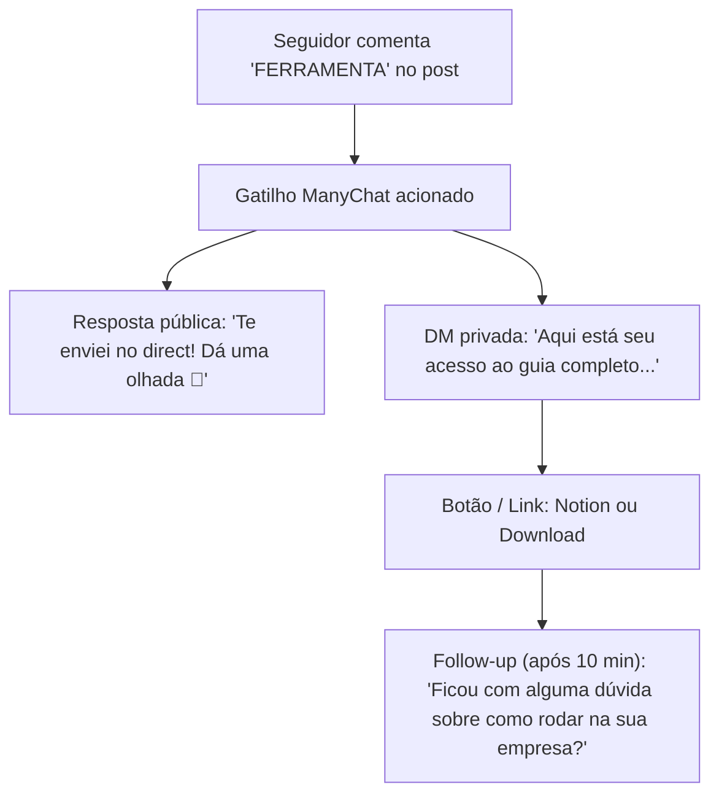

# 🗺️ Roadmap de Automações: Comentários e Direct (Instagram)

Este documento registra o planejamento estratégico e arquitetural para implementar automações de **Comment-to-DM** e atendimento automático para o perfil **@escoladeferramentas**.

---

## 🎯 Objetivo
Transformar o engajamento orgânico dos carrosséis e posts (comentários com palavras-chave) em:
1. Entrega instantânea de lead magnets (prompts, guias, blueprints, automações, templates);
2. Abertura de conversas qualificadas no Direct (DM);
3. Direcionamento para produtos, comunidades ou propostas de serviços.

---

## 🏗️ Modelos de Implementação

### Fase 1: ManyChat Oficial (Recomendado / Plug & Play)
* **Status:** Planejado para ativação
* **Canal:** Parceria oficial Meta
* **Mecanismo:**
  * Gatilho: Usuário comenta palavra-chave no post (ex: `SKILL`, `FLUXO`, `SETUP`, `01`).
  * Ação Pública: Resposta automática ao comentário com rotação de 5 a 10 frases aleatórias para evitar padrão de spam do Instagram.
  * Ação Privada (DM): Envio imediato da mensagem com link do material + CTA de engajamento.

#### Exemplo de Fluxo:

---

### Fase 2: Integração Customizada / Webhook Próprio (Opcional Futuro)
* **Status:** Backlog técnico
* **Stack:** Node.js / n8n / Meta Graph API (Webhooks)
* **Requisitos:**
  * App Meta em produção com permissões `instagram_manage_comments` e `instagram_manage_messages`.
  * Endpoint HTTPS dedicado para receber eventos em tempo real (`feed` e `messages`).
  * Armazenamento de leads e métricas de conversão.

---

## 📋 Checklist de Prontidão
- [ ] Definir as palavras-chave padrão para cada linha editorial (`DESIGN`, `IA`, `FLUXO`, `GUIA`).
- [ ] Criar biblioteca de variações de respostas de comentários.
- [ ] Conectar perfil @escoladeferramentas ao painel do ManyChat.
- [ ] Testar disparo em post de teste antes de veicular em escala.
